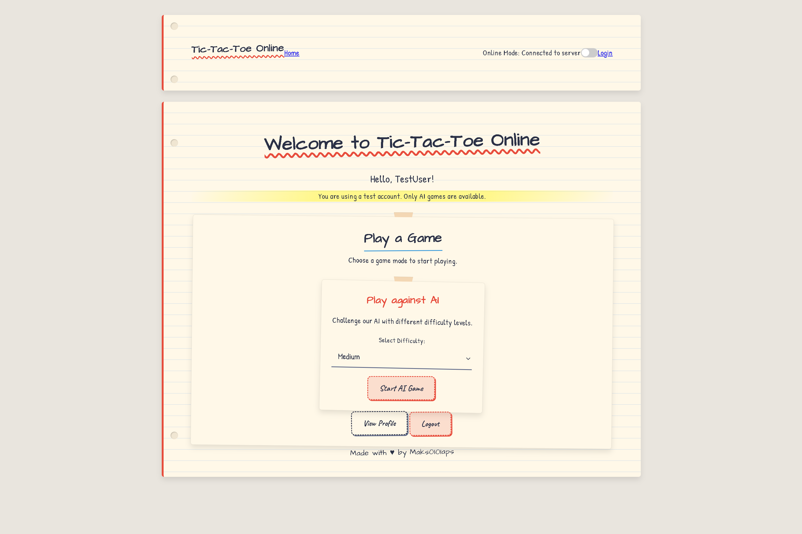

# Tic-Tac-Toe Online - Notebook Edition

A stylish multiplayer Tic-Tac-Toe game with a notebook theme and real-time gameplay.

## **⚠️ IMPORTANT: ONLINE FUNCTIONALITY IS NOT WORKING ⚠️**

**This is a demonstration project. The online multiplayer features are simulated and will not connect to real external servers. Use the Offline Mode to play across browser windows on the same device.**

## Preview




## Features

- User registration and authentication (simulated)
- Create and join games with shareable game codes (in offline mode)
- Play against AI with different difficulty levels
- Responsive notebook-themed design
- Easter eggs and hidden features

## Project Structure

The project is organized into frontend and backend parts:

```
.
├── frontend/                # Frontend code
│   ├── public/              # Public assets
│   ├── src/
│   │   ├── assets/          # Images and static assets
│   │   ├── components/      # UI components
│   │   │   ├── AIGamePage.ts    # AI game page
│   │   │   ├── AuthForms.ts     # Login/register forms
│   │   │   ├── Chat.ts          # Game chat component
│   │   │   ├── GameBoard.ts     # Tic-tac-toe game board
│   │   │   ├── GamePage.ts      # Multiplayer game page
│   │   │   ├── HomePage.ts      # Home/landing page
│   │   │   └── Navbar.ts        # Navigation bar
│   │   ├── services/        # Client-side services
│   │   │   ├── aiService.ts     # AI game logic
│   │   │   ├── authService.ts   # Authentication
│   │   │   ├── gameService.ts   # Game state management
│   │   │   └── socketService.ts # Real-time communication
│   │   ├── types/           # TypeScript interfaces
│   │   ├── utils/           # Helper functions
│   │   ├── config.ts        # App configuration
│   │   ├── main.ts          # Entry point
│   │   └── style.css        # Global styles
│   ├── index.html           # HTML template
│   ├── tsconfig.json        # TypeScript configuration
│   └── vite.config.ts       # Vite bundler config
│
├── backend/                 # Backend code
│   ├── src/
│   │   ├── config/          # Server configuration
│   │   ├── controllers/     # API controllers
│   │   ├── middlewares/     # Express middlewares
│   │   ├── models/          # Data models
│   │   ├── routes/          # API endpoints
│   │   ├── services/        # Business logic
│   │   └── server.ts        # Server entry point
│
└── README.md                # Project documentation
```

## Tech Stack

### Frontend
- TypeScript
- CSS with notebook-style design
- Vite as build tool

### Backend (Simulated)
- Node.js with Express
- TypeScript
- Offline mode for local gameplay

## How to Use

### Setup and Installation

1. Navigate to the frontend directory:
   ```
   cd frontend
   ```

2. Install dependencies:
   ```
   npm install
   ```

3. Start the development server:
   ```
   npm run dev
   ```

4. Open your browser and navigate to the URL shown in the terminal.

### Playing the Game

1. **Login or Register:** Use the test account or create a temporary account
   - Test account: Email: `test@example.com` / Password: `password123`

2. **Switch to Offline Mode:** Toggle the switch in the navbar to enable offline mode

3. **Play Against AI:**
   - Select a difficulty level (Easy, Medium, Hard)
   - Click "Start AI Game"

4. **Play Multiplayer (Offline Mode):**
   - Create a game in one browser window
   - Copy the generated game code
   - Open another browser window and join using the code

## Hidden Easter Eggs 🥚

This project contains two hidden Easter eggs referencing the creator:

1. **Footer Link:** 
   - Look for a subtle, low-opacity footer at the bottom of the home pages
   - The text gets more visible when you hover over it
   - It contains a link to the creator's GitHub profile

2. **Secret Key Combination:**
   - When on any page (not focused on an input field), type: `m-a-k-s`
   - This will trigger a special modal with information about the creator
   - The modal contains links to the creator's other projects

## Developer Notes

The game uses a handwritten/notebook design theme throughout the UI:
- Paper-like backgrounds
- Handwritten fonts
- Dashed borders and sketch-like elements
- Red margin line and notebook holes

## Offline Mode

Since the online functionality is not working, the game includes an offline mode that allows:
- Creating game codes that can be shared between browser windows
- Playing against different levels of AI
- Testing all game mechanics locally

To use offline mode, toggle the switch in the top-right corner of the navigation bar.

## License

MIT

---

Created by [Maks0101aps](https://github.com/Maks0101aps)